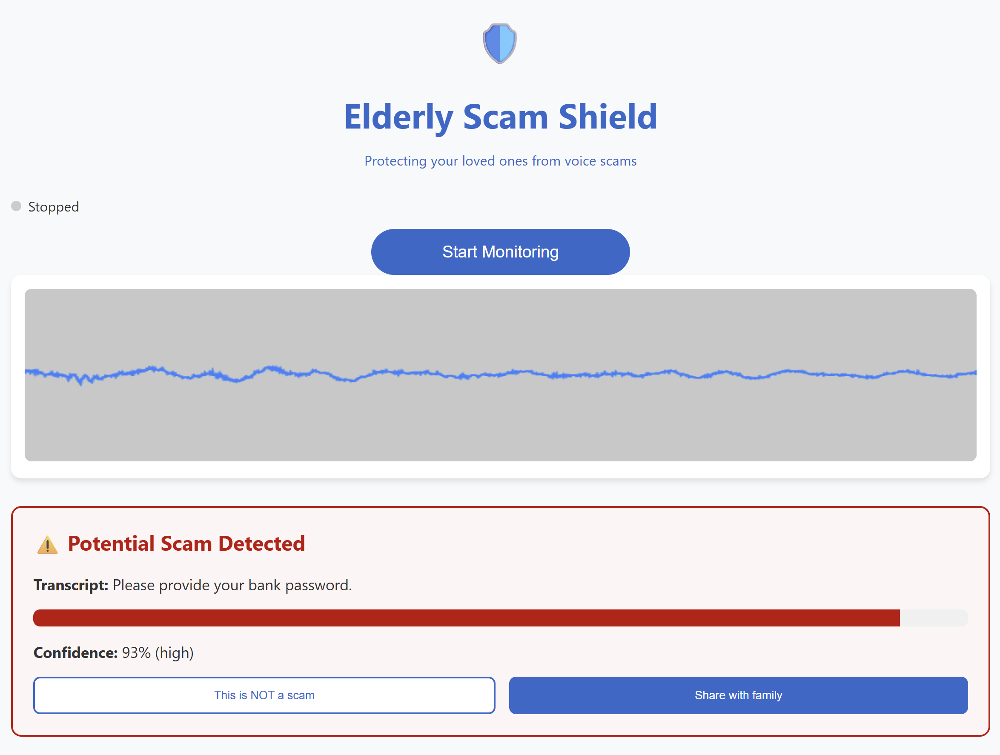

# Elderly Scam Shield 🛡️

> A real-time voice scam detector to protect our elderly loved ones

## The Story Behind This Project

When my grandmother almost fell victim to a phone scam last year, it hit home how vulnerable our elderly family members are to increasingly sophisticated voice scams. This project was born from a simple question: "How can we protect our loved ones while preserving their independence?"

## 🎥 Demo Video
[](https://drive.google.com/file/d/1r4WroSja_BnJ5iMtJEcH1K6keB4VAxQn/view?usp=sharing)

## What We've Built

We've created a real-time scam detection system that:
- Listens to phone conversations
- Transcribes speech to text in real-time
- Analyzes the content for scam patterns
- Provides immediate, clear warnings
- Lets family members stay informed

[](https://elderlyscamshield.demo)
[](LICENSE)

## Key Features 🌟

- **Real-time Scam Detection**: Monitors phone conversations and detects potential scams as they happen
- **High Accuracy**: Advanced ML model trained on extensive scam conversation data
- **Low Latency**: Response time under 2-3 seconds for immediate protection
- **Privacy First**: All processing happens locally with optional cloud backup
- **User-Friendly Interface**: Large, clear buttons and warnings designed for elderly users
- **Visual Audio Feedback**: Real-time audio visualization shows active monitoring
- **Continuous Monitoring**: Keeps protecting even after initial detection
- **Session Timer**: Tracks duration of monitoring sessions
- **Smart Audio Processing**: 
  - Noise reduction and voice enhancement
  - Adaptive gain control
  - Dynamic silence detection
  - Overlapping audio analysis for context
- **Instant Alerts**: Clear visual warnings when potential scams are detected
- **Multi-language Support**: Works with multiple languages and accents
- **Family Integration**: Share suspicious calls with family members
- **Feedback System**: Users can mark false positives to improve accuracy

## Technology Stack 💻

### Frontend
- React for robust UI components
- Web Audio API for high-quality audio processing
- WebSocket for real-time communication
- Advanced audio processing pipeline:
  - Dynamic compression
  - Noise gating
  - Adaptive gain control
  - Smart silence detection

### Backend
- FastAPI for high-performance API and WebSocket handling
- Whisper AI for accurate speech-to-text
- Custom ML classifier for scam detection
- Optimized audio processing pipeline

## Challenges We Faced 🤔

Building this wasn't easy. Here are some real challenges we encountered:

### Speech Recognition Accuracy
- Whisper works well but has latency issues
- Real-time transcription is tricky with overlapping speech
- Background noise affects accuracy
- Free API limitations impact performance
- Had to balance between speed and accuracy

### Model Training Struggles
- Limited training data for scam conversations
- Scammers constantly change their tactics
- False positives can be frustrating
- Need more real-world data
- Balancing sensitivity vs specificity

### Technical Hurdles
- Audio processing in browser is complex
- WebSocket connections can be unstable
- Memory management with continuous audio
- Browser compatibility issues
- Mobile optimization challenges

## What's Next? 🚀

### Short Term Goals
1. Better speech recognition accuracy
   - Fine-tune Whisper for phone conversations
   - Implement noise reduction
   - Optimize for elderly voices
   
2. Improved Model Training
   - Collect more real scam data
   - Add multi-language support
   - Implement continuous learning
   - Reduce false positives

### Long Term Vision
1. **Offline Mode**: Local processing for privacy
2. **Multi-Language**: Support for various languages and accents
3. **Smart Learning**: Adapt to user's specific situation
4. **Community Features**: Share known scam patterns
5. **Voice Biometrics**: Detect synthetic/deepfake voices

## Getting Started 🏁

1. Clone the repository
2. Install dependencies:
   ```bash
   cd backend && pip install -r requirements.txt
   cd frontend && npm install
   ```
3. Start the services:
   ```bash
   # Backend
   uvicorn app.main:app --reload
   # Frontend
   npm start
   ```

## Current State and Limitations 🎯

Being transparent about where we are:

### What Works Well
- Real-time audio capture and streaming
- Basic scam pattern detection
- Simple, clear warnings
- Audio visualization
- Session timing
- User feedback collection

### Known Limitations
- Speech recognition can be slow (free API constraints)
- False positives on some normal conversations
- Limited language support
- Needs better noise handling
- Model needs more training data

---

Built with ❤️ to protect our elderly loved ones from scams, one conversation at a time.

Remember: This tool is an aid, not a replacement for awareness and caution.
